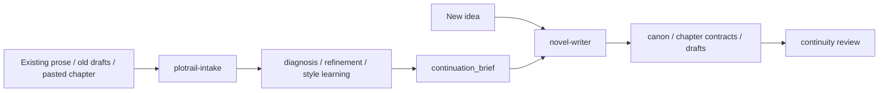

<p align="center">
  
</p>

<p align="center">
  <a href="README.md">中文</a> · <a href="README.en.md">English</a>
</p>

<p align="center">
  <a href="#install-in-30-seconds">Install</a> ·
  <a href="#watch-the-demo">Demo</a> ·
  <a href="#why-plotrail-intake-exists">Intake</a> ·
  <a href="#first-prompt-to-run">First prompt</a> ·
  <a href="#case-study">Case study</a>
</p>

# PlotRail

PlotRail is a canon-aware AI fiction workflow for Codex, Claude Code, and other file-based agents. It turns long fiction into a durable project instead of asking one fragile chat to remember an entire book.

It now includes two complementary skills:

- `novel-writer`: start from an idea, build canon, plan chapter contracts, draft prose, and maintain long-term story memory.
- `plotrail-intake`: bring existing prose into the same system through diagnosis, refinement, style learning, continuity audit, and compact handoff.

```text
One prompt should not carry an entire book.
PlotRail gives the agent rails: canon first, contract before prose, review after every draft, and intake for existing chapters.
```

## Watch the Demo

<p align="center">
  <a href="assets/plotrail-promo.mp4">
    
  </a>
</p>

<p align="center">
  <a href="assets/plotrail-promo.mp4"><strong>Watch the full 42-second MP4 demo</strong></a>
</p>

## Why This Exists

AI can write fluent scenes. Long fiction breaks when the model:

- changes character motivation halfway through a volume
- reveals secrets before the reader or cast should know them
- forgets unpaid plot threads and foreshadowing
- lets the protagonist win because the outline needs them to win
- ignores how the author revised earlier chapters

PlotRail solves this by making the agent work like a disciplined writing-room assistant. It writes files, asks for approval before canon changes, and reviews drafts against the story state instead of trusting chat memory.

## Why PlotRail Intake Exists

Standalone repository: [waylean/plotrail-intake](https://github.com/waylean/plotrail-intake)

After sharing PlotRail with Chinese writing communities, I saw interest through likes and bookmarks, but what I wanted most was feedback from people actually trying it on their own fiction.

One useful suggestion was: what if the agent could read already-written chapters one by one, slow down, and focus on the details before continuing?

That became `plotrail-intake`.

`novel-writer` is strongest at the beginning of a project: build canon, plan the chapter, draft inside constraints, then review. But many writers already have prose: one pasted chapter, a messy old draft, or a hand-written manuscript that should not be thrown away.

`plotrail-intake` handles that lane:

- diagnose existing prose before continuing it
- refine chapters without changing plot authority by accident
- reduce AI-flavored polish while preserving author voice
- learn style from manuscript samples
- audit long-form consistency across chapters
- produce a compact `continuation_brief` for `novel-writer`

Together, the two skills should do more than either one alone: one sets rails before writing, the other keeps finished prose from drifting after it exists.

## What You Get

Current capabilities:

- turn ideas into story proposals without prematurely writing canon
- create story bibles, relationships, timelines, and chapter contracts
- define must-happen beats, forbidden moves, hooks, and continuity risks before drafting
- review each chapter against canon, character state, secrets, timeline, and hook strength
- learn reusable editing preferences from author revisions
- diagnose, refine, and audit existing manuscript material
- pass only the smallest useful brief between `plotrail-intake` and `novel-writer`

File outputs:

| Capability | What PlotRail Creates |
| --- | --- |
| Story bible | `canon/world.md`, `characters.yaml`, `relationships.yaml`, `timeline.yaml` |
| Chapter planning | `outline/chapters.yaml` contracts before prose |
| Drafting lane | `drafts/chNNN.md` with canon-bound creative freedom |
| Continuity review | `reviews/chNNN_continuity.md` after each chapter |
| Long memory | `memory/chapter_summaries.yaml`, `state_ledger.yaml`, `change_requests.yaml` |
| Author preference loop | `memory/author_editing_profile.md` learned from revisions |
| Existing manuscript intake | `reviews/`, candidate ledgers, style snapshots, and `outline/continuation_brief_chNNN.md` |

## Skills

- `novel-writer`: use for creating a long-form project, building canon, preparing chapter contracts, drafting new chapters, reviewing drafts, and maintaining accepted memory.
- `plotrail-intake`: use for existing prose: pasted chapters, old drafts, manuscript folders, chapter diagnosis, refinement, style learning, continuity audit, and compact handoff to `novel-writer`. Standalone repository: [waylean/plotrail-intake](https://github.com/waylean/plotrail-intake).

When both skills are used, `plotrail-intake` should produce a concise continuation brief instead of passing all raw chapters and full audit notes to `novel-writer`.



## Install In 30 Seconds

Install both complementary skill folders:

```bash
git clone https://github.com/waylean/plotrail.git
mkdir -p ~/.codex/skills
cp -R plotrail/novel-writer ~/.codex/skills/novel-writer
cp -R plotrail/plotrail-intake ~/.codex/skills/plotrail-intake
```

Restart Codex if it does not detect the skill.

For Claude Code, copy the same folder to:

```text
~/.claude/skills/novel-writer
~/.claude/skills/plotrail-intake
```

More options: see [INSTALL.md](INSTALL.md).

## First Prompt To Run

Open or create a novel folder, then say:

```text
Use the novel-writer skill.

Initialize this folder as a long-form novel project.
Do not write prose yet.

First help me turn my theme, core idea, target readers, taboo content,
style references, and ending direction into 3 story proposals.
Keep proposals outside canon until I approve one.
```

Then provide:

```text
Theme:
Core idea:
Genre:
Target readers:
Main character:
Antagonist:
Comparable works:
Things I dislike:
Ending direction:
Platform / length target:
```

For an existing chapter or manuscript, start with:

```text
Use $plotrail-intake.
This is existing prose. Do not continue it yet.
First diagnose the manuscript state, identify the strongest problems, and prepare the smallest useful next pass.
```

For a single chapter refinement pass:

```text
Use $plotrail-intake.
The text below is an already-written chapter.
Use light refinement: do not change the plot, do not add canon.
Focus on pacing, motivation, anti-AI prose, chapter hook, and continuity risks.
List any change that needs author approval.
```

## Workflow


1. The author gives the theme, audience, constraints, and ending preference.
2. The agent creates proposals, not canon.
3. The author approves a direction.
4. The agent writes approved material into `canon/` and `outline/`.
5. Every chapter starts with a contract.
6. Prose is drafted only after the contract is accepted or explicitly requested.
7. A continuity review checks canon, character state, secrets, timeline, and hook strength.
8. Author revisions become reusable editing preferences.

## Case Study

The [`examples/假如我成为了反派/`](examples/%E5%81%87%E5%A6%82%E6%88%91%E6%88%90%E4%B8%BA%E4%BA%86%E5%8F%8D%E6%B4%BE/) folder shows PlotRail on a working Chinese web-novel project.

The first 11 chapters demonstrate how the workflow improves:

- protagonist agency through procedure, constraint, fallback, and cost
- antagonist competence
- rule placement and reveal timing
- chapter-end hooks
- moral consequence after taking over the villain's body
- continuity across a serial arc

The key author preference extracted from the revisions:

```text
Do not let the protagonist win because the plot needs him to win.
Show the procedure, constraint, test, fallback, and cost.
```

Open the proof files:

- [sample chapter contract](examples/%E5%81%87%E5%A6%82%E6%88%91%E6%88%90%E4%B8%BA%E4%BA%86%E5%8F%8D%E6%B4%BE/sample-chapter-contract.md)
- [sample continuity review](examples/%E5%81%87%E5%A6%82%E6%88%91%E6%88%90%E4%B8%BA%E4%BA%86%E5%8F%8D%E6%B4%BE/sample-continuity-review.md)
- [author editing profile](examples/%E5%81%87%E5%A6%82%E6%88%91%E6%88%90%E4%B8%BA%E4%BA%86%E5%8F%8D%E6%B4%BE/author-editing-profile.md)

## Model Compatibility

PlotRail works best with agents that can read and write local files:

- Codex with a strong reasoning/coding model
- Claude Code with Skills support
- any agent that supports `SKILL.md`, local project files, and multi-step workflows

If your tool does not support automatic skill loading, open `novel-writer/SKILL.md`, copy the core rules into your system prompt or project instructions, and use `novel-writer/references/` as project knowledge.
For existing manuscripts, open `plotrail-intake/SKILL.md` and load only the reference file needed for the current task.

## Repository Map

```text
novel-writer/
  SKILL.md
  references/
    canon-schemas.md
    chapter-workflow.md
    human-edit-loop.md
  scripts/
    init_novel_project.py
plotrail-intake/
  SKILL.md
  references/
    intake-protocol.md
    anti-ai-prose.md
    diagnosis-rubric.md
    refinement-workflow.md
    style-learning.md
    continuity-audit.md
    novel-writer-handoff.md
    shared-context.md
examples/
  假如我成为了反派/
assets/
  plotrail-wordmark.svg
  plotrail-promo-preview.gif
  plotrail-promo.mp4
```

## Rename Notice

PlotRail was formerly published as `novel-writer`. The repository name changed to make the purpose clearer: keeping AI-assisted long-form fiction on a durable plot rail. The installable skill folder and invocation name remain `novel-writer` for compatibility.

## License

MIT License.
